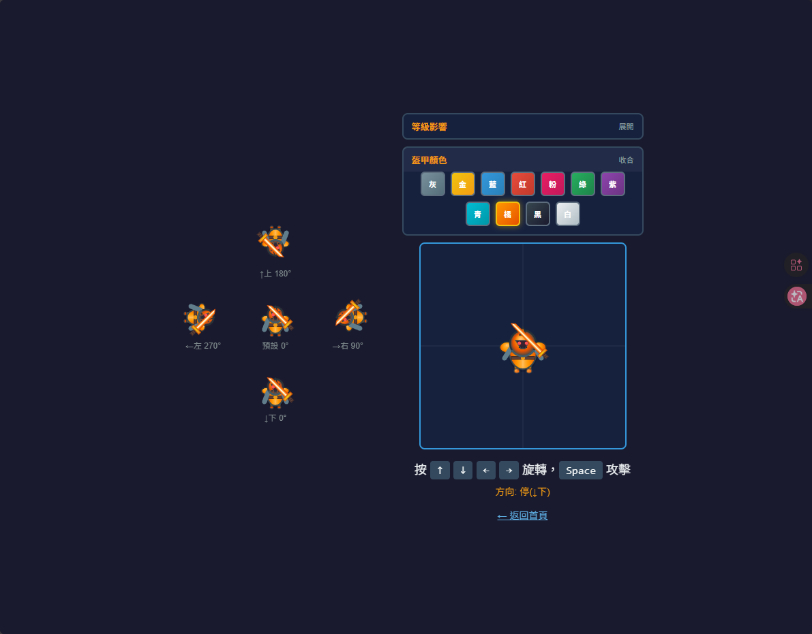
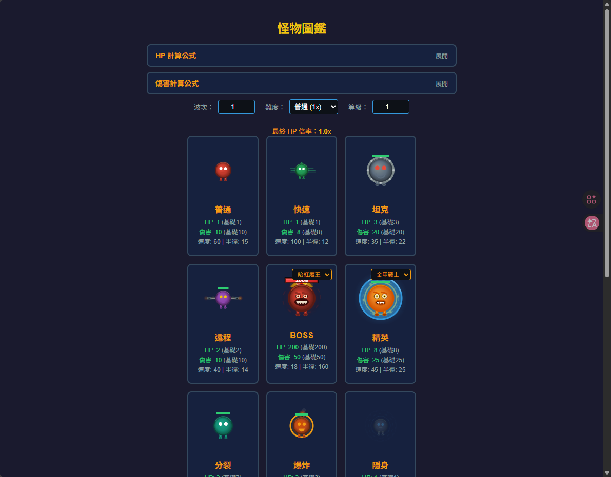
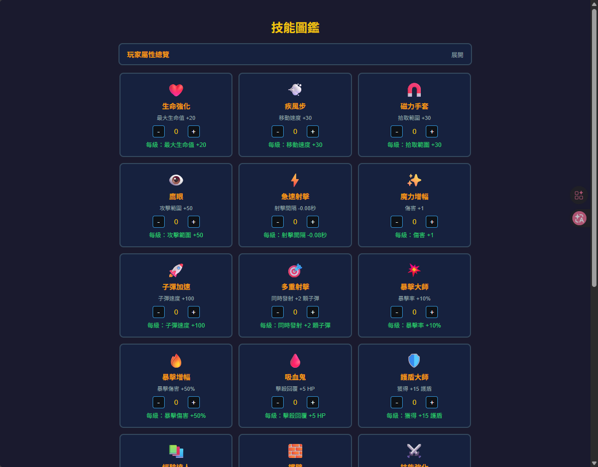

# survivor.js

網頁版生存遊戲 - 類倖存者 (Survivor-like) 遊戲








## 遊戲特色

- 純 JavaScript + HTML5 Canvas 實現
- 自動戰鬥系統：玩家專注走位，主角自動索敵射擊
- 割草體驗：高頻率敵人生成與流暢擊殺回饋
- 成長循環：擊殺 → 掉落經驗球 → 升級 → 三選一隨機天賦強化
- 13 種敵人類型 + 3 階段 BOSS 戰
- 20 種被動技能 + 6 種狀態效果
- 4 個關卡 + 5 種難度

## 操作方式

| 按鍵 | 功能 |
|------|------|
| WASD / 方向鍵 | 移動角色 |
| ESC / P | 暫停遊戲 |
| Q | 使用主動技能（全屏攻擊） |
| 自動 | 範圍內最近敵人自動射擊 |

## 遊戲規則

### 勝利條件

| 難度 | 破關條件 |
|------|----------|
| 簡單 | 存活 15 分鐘 |
| 普通 | 存活 20 分鐘 |
| 困難 | 存活 25 分鐘 + 擊敗 3 個 BOSS |
| 地獄 | 存活 30 分鐘 + 擊敗 5 個 BOSS |
| 噩夢 | 存活 35 分鐘 + 擊敗 8 個 BOSS |

### 失敗條件

玩家 HP 歸零時遊戲結束。

### 升級系統

- 擊殺敵人掉落綠色經驗球
- 拾取經驗球累積經驗值
- 升級時從 3 個隨機技能中選擇 1 個
- 玩家等級上限 50 級
- 滿級後每次升級獎勵：傷害 +2、HP +30

### 技能系統（20 種被動技能）

| 技能 | 效果 | 圖標 |
|------|------|------|
| 生命強化 | 最大生命值 +20 | ❤️ |
| 疾風步 | 移動速度 +30 | 💨 |
| 磁力手套 | 拾取範圍 +30 | 🧲 |
| 鷹眼 | 攻擊範圍 +50 | 👁️ |
| 急速射擊 | 射擊間隔 -0.08秒 | ⚡ |
| 魔力增幅 | 傷害 +1 | ✨ |
| 子彈加速 | 子彈速度 +100 | 🚀 |
| 多重射擊 | 同時發射 +2 顆子彈 | 🎯 |
| 暴擊大師 | 暴擊率 +10% | 💥 |
| 暴擊增幅 | 暴擊傷害 +50% | 🔥 |
| 吸血鬼 | 擊殺回覆 +5 HP | 🩸 |
| 護盾大師 | 獲得 +15 護盾 | 🛡️ |
| 經驗達人 | 經驗值獲取 +20% | 📚 |
| 鐵壁 | 受到傷害 -5 | 🧱 |
| 技能強化 | 主動技能傷害 +30% | ⚔️ |
| 冷卻縮減 | 主動技能冷卻 -3 秒 | ⏳ |
| 穿透射擊 | 子彈可穿透 +1 個敵人 | 🏹 |
| 灼燒之觸 | 攻擊附帶 3 秒灼燒 DOT | 🔥 |
| 冰凍之觸 | 15% 機率冰凍敵人 1.5 秒 | ❄️ |
| 荊棘護甲 | 受擊時反彈 20% 傷害 | 🌵 |

### 狀效效果

| 效果 | 說明 | 視覺 |
|------|------|------|
| 灼燒 | 每秒造成持續傷害，持續 3 秒 | 火焰粒子環繞 |
| 冰凍 | 移動速度歸零，持續 1.5 秒 | 冰霜光暈 + 冰晶碎片 |

## 敵人類型（13 種）

| 類型 | 名稱 | 特色 | 出現時間 |
|------|------|------|----------|
| 普通 | 標準敵人 | 基本屬性 | 開始 |
| 快速 | 高速敵人 | 速度 +67% | 30 秒 |
| 坦克 | 重裝敵人 | HP ×3、傷害 ×2 | 60 秒 |
| 遠程 | 射擊敵人 | 雙管火箭筒 | 45 秒 |
| 精英 | 強化敵人 | 護盾 + 金色光環 | 90 秒 |
| 分裂 | 分裂敵人 | 死亡分裂成 2 個 | 60 秒 |
| 爆炸 | 自爆敵人 | 死亡爆炸範圍傷害 | 45 秒 |
| 隱身 | 隱形敵人 | 半透明 + 旋轉虛線圈 | 75 秒 |
| 飛行 | 飛行敵人 | 翅膀拍動 + 頂部光環 | 50 秒 |
| 召喚 | 召喚敵人 | 旋轉魔法陣 + 召喚粒子 | 120 秒 |
| 吸血 | 吸血敵人 | 擊中回血 + 吸血爪 | 60 秒 |
| 裝甲 | 重裝敵人 | 受傷減 50% + 裝甲板 | 80 秒 |
| 狂暴 | 狂暴敵人 | 每次受擊速度 +10 | 40 秒 |

## BOSS 戰

### BOSS 階段

| 階段 | 血量 | 行為 |
|------|------|------|
| 第一階段 | 100%-60% | 環形彈幕（6 發） |
| 第二階段 | 60%-30% | 追蹤彈 + 召喚小怪 |
| 第三階段（狂暴） | 30%-0% | 螺旋彈（12 發）+ 召喚加速 + 畫面震撼 |

### BOSS 造型

每次出現隨機一種造型（6 種暗黑風格）：
- 暗紅魔王、暗紫亡靈、暗綠毒龍
- 暗金龍王、暗藍深淵、暗黑虛空

## 關卡系統（4 個關卡）

| 關卡 | 名稱 | 背景色 | BOSS 血量加成 |
|------|------|--------|---------------|
| 🌲 | 翡翠森林 | 深綠 | ×1 |
| 🏜️ | 炙熱沙漠 | 深棕 | ×1.3 |
| ❄️ | 冰封雪原 | 深藍 | ×1.6 |
| 🌋 | 熔岩火山 | 深紅 | ×2 |

## 難度系統（5 種難度）

| 難度 | 敵人數量 | 敵人HP | 敵人傷害 | 玩家HP | BOSS HP |
|------|----------|--------|----------|--------|---------|
| 簡單 | ×0.7 | ×0.7 | ×0.7 | ×1.3 | ×0.8 |
| 普通 | ×1 | ×1 | ×1 | ×1 | ×1 |
| 困難 | ×1.5 | ×1.5 | ×1.3 | ×0.8 | ×2 |
| 地獄 | ×2 | ×3 | ×1.5 | ×0.8 | ×4 |
| 噩夢 | ×2.5 | ×5 | ×2 | ×0.6 | ×6 |

## 系統需求

- 現代瀏覽器（支援 ES6+ JavaScript）
- 建議使用 Chrome、Firefox、Edge 最新版本

## 快速開始

### 啟動遊戲

```bash
npm run dev
# 瀏覽器打開 http://localhost:3000
```

### 遊戲流程

1. 選擇關卡（翡翠森林 / 炙熱沙漠 / 冰封雪原 / 熔岩火山）
2. 選擇難度（簡單 / 普通 / 困難 / 地獄 / 噩夢）
3. 使用 WASD 移動避開敵人
4. 自動攻擊最近的敵人
5. 收集經驗球升級
6. 選擇強化天賦讓角色更強
7. 達成破關條件或死亡

---

## 📚 文件中心 (Documentation Center)

本專案提供完善的開發與設計文件，請參考以下連結：

- **[產品需求文件 (PRD)](docs/PRD.md)**：遊戲核心規格、機制與系統設計。
- **[技術架構與規格](docs/TECHNICAL_SPECS.md)**：組合模式架構、調試機制與檔案結構詳解。
- **[AI Agent 開發規範](docs/AGENT_GUIDELINES.md)**：專為 AI 協作設計的開發流程、Update Loop 相位與 Checklist。
- **[AI 成本優化與高效開發課程](docs/tutorials/ai-cost-optimization-course.md)**：仿照多奇教育訓練設計的「AI 寫程式省錢術」，解密 Prompt Caching 與對話壓縮等省錢實戰。
- **[遊戲開發工具規格](docs/TOOL_SPECS.md)**：TileManager 裁切原理、TilesetCleaner 操作手冊。
- **[專案開發進度](docs/PROJECT_STATUS.md)**：功能清單、Bug 修復紀錄與重構歷程。
- **[引擎選擇分析](docs/ENGINE_ANALYSIS.md)**：為何選擇純 Canvas API 的決策過程。

---

## 🛠️ Tileset 清理工具

設計稿通常包含素材與說明文字，導致自動裁切錯亂。我們開發了專用工具來手動框選純素材區域。

- **啟動方式**：`npm run dev` 並開啟 `http://localhost:3000/tilesetCleaner.html`
- **詳細手冊**：請參考 **[開發工具規格](docs/TOOL_SPECS.md)**

---

## 專案結構

```
survivor.js/
├── index.html              # 遊戲主頁面
├── test-player.html        # 角色測試頁面
├── test-enemy.html         # 怪物圖鑑頁面
├── test-skill.html         # 技能測試頁面
├── tilesetCleaner.html     # Tileset 清理工具
├── docs/                   # 📚 專案文件中心
├── config/
│   ├── enemies.json        # 敵人設定
│   ├── skills.json         # 技能設定
│   ├── player.json         # 玩家設定
│   └── angles.json         # 角度設定
├── css/
│   └── style.css           # 遊戲樣式
├── js/
│   ├── main.js             # 入口檔案
│   ├── game.js             # 遊戲主邏輯
│   ├── player.js           # 玩家類別
│   ├── playerRenderer.js   # 玩家渲染器
│   ├── playerCombat.js     # 玩家戰鬥系統
│   ├── enemy.js            # 敵人類別
│   ├── enemyRenderer.js    # 敵人渲染器
│   ├── enemyCore.js        # 敵人核心屬性
│   ├── enemyBehaviors.js   # 敵人行為
│   ├── bossPhaseManager.js # BOSS 階段管理
│   ├── waveManager.js      # 波次管理
│   ├── talent.js           # 天賦系統
│   ├── experience.js       # 經驗球
│   ├── projectile.js       # 投射物
│   ├── objectPool.js       # 物件池
│   ├── spatialGrid.js      # 空間網格
│   ├── damageNumber.js     # 傷害數字
│   ├── achievement.js      # 成就系統
│   ├── storage.js          # 存檔系統
│   ├── audio.js            # 音效系統
│   ├── ui.js               # UI 管理
│   └── decoration.js       # 場景裝飾
├── package.json            # 專案設定
└── README.md               # 專案說明
```

## 授權

MIT License
