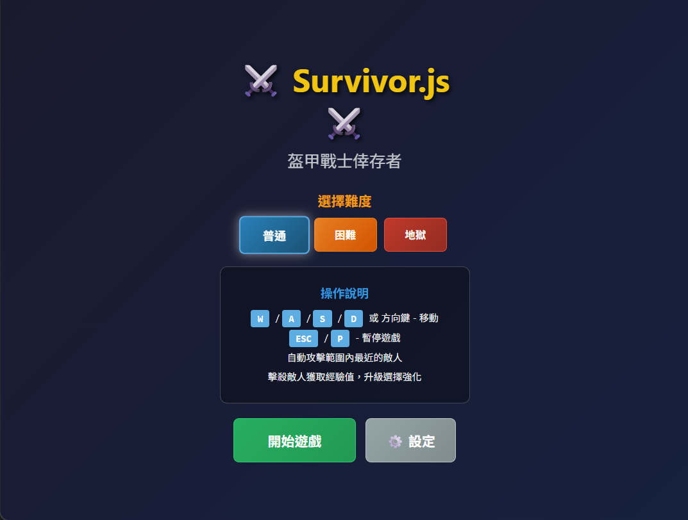
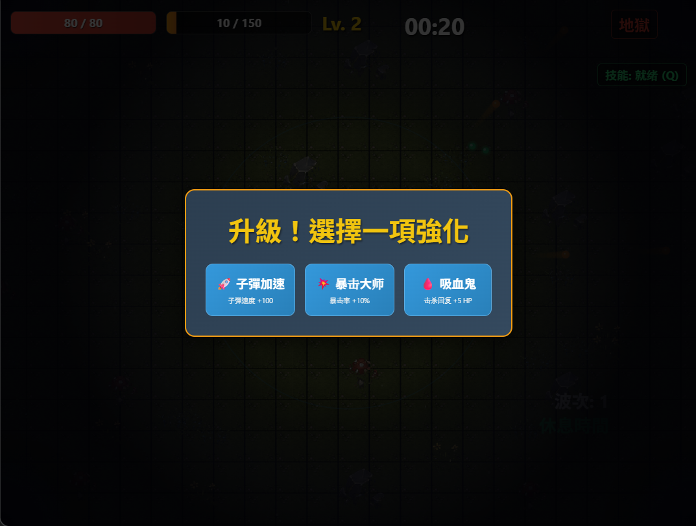
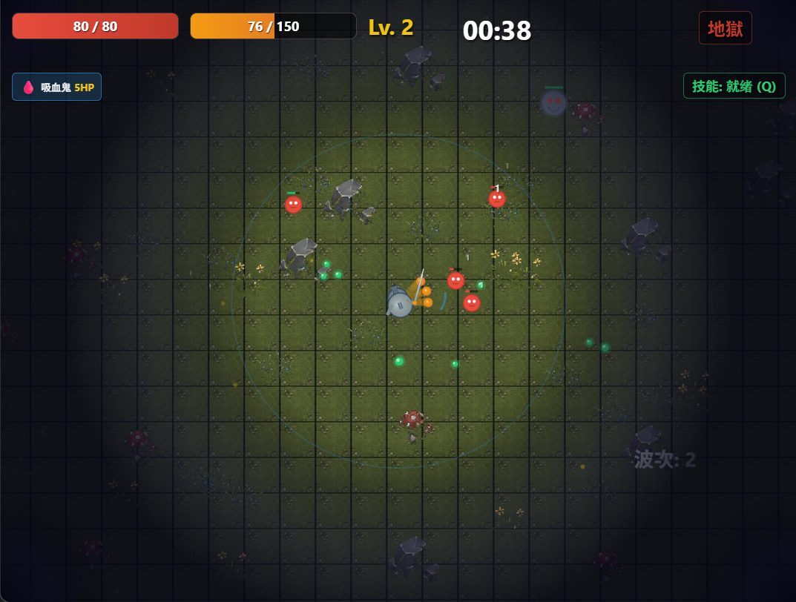

# survivor.js

網頁版生存遊戲 - 類倖存者 (Survivor-like) 遊戲 Demo







## 遊戲特色

- 純 JavaScript + HTML5 Canvas 實現
- 自動戰鬥系統：玩家專注走位，主角自動索敵射擊
- 割草體驗：高頻率敵人生成與流暢擊殺回饋
- 成長循環：擊殺 → 掉落經驗球 → 升級 → 三選一隨機天賦強化

## 操作方式

- **WASD** 或 **方向鍵**：移動角色

## 系統需求

- 現代瀏覽器（支援 ES6+ JavaScript）
- 建議使用 Chrome、Firefox、Edge 最新版本

## 快速開始

### 啟動遊戲

```bash
npm run dev
# 瀏覽器打開 http://localhost:3000
```

### 遊戲流程

1. 使用 WASD 移動避開敵人
2. 自動攻擊最近的敵人
3. 收集經驗球升級
4. 選擇強化天賦讓角色更強

---

## 📚 文件中心 (Documentation Center)

本專案提供完善的開發與設計文件，請參考以下連結：

- **[產品需求文件 (PRD)](docs/PRD.md)**：遊戲核心規格、機制與系統設計。
- **[技術架構與規格](docs/TECHNICAL_SPECS.md)**：組合模式架構、調試機制與檔案結構詳解。
- **[AI Agent 開發規範](docs/AGENT_GUIDELINES.md)**：專為 AI 協作設計的開發流程、Update Loop 相位與 Checklist。
- **[遊戲開發工具規格](docs/TOOL_SPECS.md)**：TileManager 裁切原理、TilesetCleaner 操作手冊。
- **[專案開發進度](docs/PROJECT_STATUS.md)**：功能清單、Bug 修復紀錄與重構歷程。
- **[引擎選擇分析](docs/ENGINE_ANALYSIS.md)**：為何選擇純 Canvas API 的決策過程。
- **[素材使用指南](docs/TILESET_GUIDE.md)** / **[素材修復指南](docs/TILESET_FIX_GUIDE.md)**：Tileset 相關技術細節。

---

## 🛠️ Tileset 清理工具

設計稿通常包含素材與說明文字，導致自動裁切錯亂。我們開發了專用工具來手動框選純素材區域。

- **啟動方式**：`npm run dev` 並開啟 `http://localhost:3000/tilesetCleaner.html`
- **詳細手冊**：請參考 **[開發工具規格](docs/TOOL_SPECS.md)**

---

## 🎨 專業切圖工具建議

對於專業開發流程，建議結合使用 **TexturePacker** 與 **Tiled Map Editor**。詳細的工具對比與組合使用流程請參考 **[專業工具推薦](docs/TOOL_SPECS.md#3-專業切圖工具推薦)**。

---

## 專案結構

```
survivor.js/
├── index.html              # 遊戲主頁面
├── tilesetCleaner.html     # Tileset 清理工具
├── docs/                   # 📚 專案文件中心 (PRD, 技術規格, 規範等)
├── css/
│   └── style.css           # 遊戲樣式
├── js/
│   ├── main.js             # 入口檔案
│   ├── game.js             # 遊戲主邏輯
│   ├── player.js           # 玩家類別
│   ├── enemy.js            # 敵人類別
│   └── ...                 # 其他遊戲模組
├── package.json            # 專案設定
└── README.md               # 專案說明
```

## 授權

MIT License
