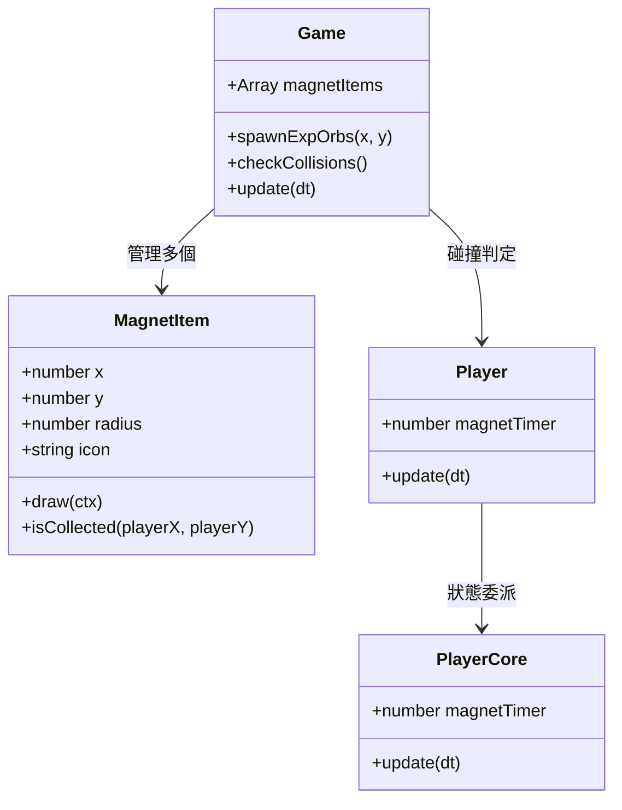

# 磁鐵道具系統設計規格書 (Magnet Drop Item Specification)

本文檔定義了 `survivor.js` 中「主動磁鐵道具系統」的規格與架構設計。

## 1. 功能概述

在目前的遊戲中，玩家僅能透過天賦升級來微幅擴大拾取半徑。為了增加戰鬥的趣味性與割草的爽快感，我們決定新增一個「主動掉落式磁鐵道具系統」。

### 核心機制：
1. **怪物理落**：擊殺怪物時，有 **3% 的低機率**在怪物死亡位置生成一個「磁鐵道具 (Magnet Item)」。
2. **外觀設計**：磁鐵道具在 Canvas 畫面上渲染為一個精緻的 **U 型磁鐵 🧲**，且帶有微弱的紅色光環。
3. **磁力風暴狀態**：
   * 玩家碰撞並拾取磁鐵道具時，會觸發 **5 秒的「磁力風暴」狀態**。
   * 若在狀態存續期間又拾取了另一個磁鐵道具，**剩餘時間將累加 (Stack)**（例如剩餘 2 秒時拾取新磁鐵，時間變為 7 秒）。
   * 磁力風暴狀態下，玩家的經驗球吸附半徑擴大為 **1000 像素 (全螢幕吸引)**。
4. **視覺特效**：
   * 當狀態處於啟動中，玩家身邊會定期繪製往外擴散、逐漸變淡的半透明藍色磁力波圓環，提供清晰的反饋。

---

## 2. 系統架構設計

為遵循專案的「單一職責」與「組合/拆分」架構，我們採用建立獨立類別的方式：

### 變更檔案清單：

#### [NEW] [magnetItem.js](file:///d:/github/chiisen/survivor.js/js/magnetItem.js)
建立獨立的 `MagnetItem` 類別：
* `constructor(x, y)`：初始化位置，設定道具半徑（8px）。
* `draw(ctx)`：在 Canvas 上渲染 🧲 圖標，以及紅色的微弱光圈。
* `isCollected(playerX, playerY, playerRadius)`：判斷玩家是否與該道具發生碰撞。

#### [MODIFY] [playerCore.js](file:///d:/github/chiisen/survivor.js/js/playerCore.js)
在玩家核心狀態中加入磁鐵計時器：
* `constructor()` 中初始化 `this.magnetTimer = 0;`。
* `update(dt)` 中，若 `this.magnetTimer > 0`，則遞減時間：`this.magnetTimer = Math.max(0, this.magnetTimer - dt);`。

#### [MODIFY] [player.js](file:///d:/github/chiisen/survivor.js/js/player.js)
暴露 `magnetTimer` 的對外介面：
* 新增 `get magnetTimer()` 與 `set magnetTimer(val)` 委派至 `this.core.magnetTimer`。

#### [MODIFY] [playerRenderer.js](file:///d:/github/chiisen/survivor.js/js/playerRenderer.js)
繪製磁力風暴特效：
* 在 `draw(ctx, core, combat)` 中，若 `core.magnetTimer > 0`，則在玩家腳下/身邊繪製往外擴散的淡藍色漸隱圓環。

#### [MODIFY] [game.js](file:///d:/github/chiisen/survivor.js/js/game.js)
整合道具生命週期與碰撞判定：
* `constructor()` 中初始化 `this.magnetItems = [];`。
* `reset()` 中清空該陣列。
* `cleanupDeadEntities()` 時，在怪物死掉的位置以 3% 機率 `this.magnetItems.push(new MagnetItem(enemy.x, enemy.y))`。
* **Phase 2 (狀態更新)**：
  * 在經驗球更新循環中，判定 `const forceAttract = (this.waveManager.isBreak && this.expOrbs.length > 0) || this.player.magnetTimer > 0;`。
  * 若滿足 `forceAttract`，則將吸引半徑設為 1000，否則使用基礎的 `this.player.pickupRange`。
* **Phase 3 (系統更新/碰撞)**：
  * 遍歷 `this.magnetItems`，檢測與玩家的距離。
  * 若玩家拾取道具：播放 `pickup` 音效，增加時間 `this.player.magnetTimer += 5`，並將該道具移出場外。
* **Phase 4 (UI 繪製)**：
  * 繪製場上所有 `magnetItems`。

---

## 3. 測試與驗證計畫

### 自動化測試：[NEW] [tests/magnet.test.js](file:///d:/github/chiisen/survivor.js/tests/magnet.test.js)
撰寫 Vitest 測試來進行 TDD 開發，驗證以下行為：
1. `PlayerCore` 初始化時，`magnetTimer` 必須為 0。
2. 呼叫 `player.update(dt)` 時，`magnetTimer` 應隨時間遞減，且不會低於 0。
3. 當 `magnetTimer > 0` 時，時間累加判定是否正確。
4. 在遊戲更新邏輯中，當 `magnetTimer > 0` 時，經驗球吸引判定半徑必須正確提升為 1000。

### 手動測試：
* 執行 `npm run dev` 進入遊戲。
* 調試模式：可在 `game.js` 的 `keydown` 事件中加入隱藏熱鍵（例如按 `M` 鍵直接觸發 `this.player.magnetTimer += 5`），手動驗證全螢幕吸球與淡藍色波特效是否正常。
