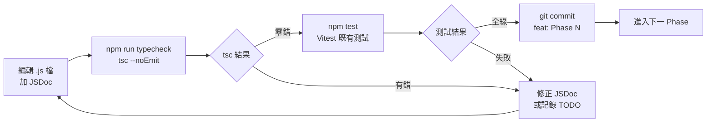

# JSDoc 型別標註與 TypeScript checkJs 工具鏈設計規格書

本文檔定義了 `survivor.js` 專案中「為核心模組加 JSDoc 型別標註,並以 TypeScript `checkJs` 進行靜態型別驗證」的工具鏈設計。

## 1. 功能概述

### 動機
目前 `survivor.js` 為純 JavaScript 專案,無 Lint/Type 工具,主要痛點:
- 函式簽名缺乏型別提示,改動時易踩到隱藏 bug
- 跨模組呼叫無靜態檢查保護
- 為將來 TypeScript 化鋪路,需先建立型別基礎

### 目標
- 為 10 個核心模組加 **基本型別 JSDoc 標註**(`@param`/`@returns`/`@type`)
- 引入 **TypeScript `checkJs`** 進行靜態型別檢查(不產出檔案,僅驗證)
- 維持現有 Vitest 測試與瀏覽器 runtime 不受影響
- 漸進式交付(5 個 Phase),每 Phase 獨立 commit,易於 review 與回滾

### 非目標
- 不將 `.js` 改為 `.ts`
- 不使用 `@template`/`@typedef` 泛型(基本嚴格度範圍)
- 不重構既有模組結構
- 不引入 GitHub Actions CI

---

## 2. 系統架構設計

### 2.1 工具鏈總覽



### 2.2 變更檔案清單

#### [NEW] `package.json` (修改)
新增 devDependency 與 npm scripts:
- `devDependencies`: 新增 `"typescript": "^5.6.0"`
- `scripts`:
  - `typecheck`: `tsc --noEmit`
  - `typecheck:watch`: `tsc --noEmit --watch`

#### [NEW] `jsconfig.json` (新增)
TypeScript checkJs 配置:
- `compilerOptions`:
  - `checkJs: true`
  - `allowJs: true`
  - `noEmit: true`
  - `target: "ES2022"`
  - `module: "ES2022"`
  - `moduleResolution: "bundler"`
  - `strict: false` (基本嚴格度)
  - `include: ["js/**/*.js"]`
  - `exclude: ["node_modules", "tests"]`

#### [MODIFY] `CHANGELOG.md`
新增條目記錄本次工具鏈新增。

#### [MODIFY] 10 個核心 JS 檔
每檔為 export 函式/類別添加 JSDoc(見 § 3)。

---

## 3. 模組設計與分階段

### 3.1 10 個核心檔分階段策略

| 階段 | 範圍 | 角色 |
|------|------|------|
| **Phase 1** | `utils.js`、`spatialGrid.js` | 先鋒驗證(無依賴 / 中等複雜度) |
| **Phase 2** | `objectPool.js`、`projectile.js` | 基礎模組(class 結構) |
| **Phase 3** | `player.js`、`enemy.js` | 組合根模組(委派模式) |
| **Phase 4** | `playerCore.js`、`playerCombat.js`、`enemyCore.js` | 子模組(型別對齊) |
| **Phase 5** | `game.js` | 整合層(最複雜) |

### 3.2 JSDoc 風格規範(基本型別標註)

#### 工具函式範本
```js
/**
 * 計算兩點間歐氏距離
 * @param {number} x1 - 點1 X 座標
 * @param {number} y1 - 點1 Y 座標
 * @param {number} x2 - 點2 X 座標
 * @param {number} y2 - 點2 Y 座標
 * @returns {number} 兩點距離
 */
export function distance(x1, y1, x2, y2) { ... }
```

#### 類別範本
```js
/**
 * 空間網格,用於碰撞檢測的空間分割
 */
export class SpatialGrid {
  /**
   * @param {number} cellSize - 網格大小(px)
   * @param {number} width - 世界寬度
   * @param {number} height - 世界高度
   */
  constructor(cellSize, width, height) { ... }

  /**
   * 插入實體到網格
   * @param {{x: number, y: number, radius: number}} entity
   */
  insert(entity) { ... }
}
```

#### 不採用
- `@template` 泛型
- `@typedef` 大量定義
- `// @ts-nocheck` 全檔忽略

### 3.3 處理現有模組的特殊點

| 模組 | 特殊挑戰 | 處理方式 |
|------|---------|---------|
| `game.js` | 最大檔、大量全域變數 | 最後處理,允許 `// @ts-expect-error` 局部註解並附 comment |
| `player.js` / `enemy.js` | 組合模式,大量 Getter/Setter 委派 | 委派方法加 `@returns {Type}` |
| `objectPool.js` | 泛型介面 (T) | 使用 `unknown` 或 inline `@template T` |
| `playerCore.js` 等子模組 | 與組合根型別對齊 | 子模組先標,根模組委派時引用 |

---

## 4. 開發流程

### 4.1 標準開發循環(每檔)
1. 開啟目標檔案
2. 為每個 export 函式/類別加 JSDoc
3. 執行 `npm run typecheck`
4. 處理 tsc 報錯:
   - 型別推導錯誤 → 修正 JSDoc
   - 跨檔型別不一致 → 調整 JSDoc 或檢查上下游
   - 既有 bug 被發現 → 記錄至 `docs/superpowers/TODO-typescript-fixes.md` 後跳過
5. 執行 `npm test` 確認既有測試不受影響
6. 提交 commit (`feat(typed): Phase N - <file list>`)

### 4.2 驗證閘門(每階段結束)

| 驗證項 | 工具 | 通過條件 |
|--------|------|---------|
| 型別檢查 | `npm run typecheck` | 零錯誤 |
| 既有測試 | `npm test` | 100% 通過 |
| 整合測試 | `npm run dev` + 瀏覽器 smoke test (Phase 1、3、5) | 30 秒無 console error、FPS ≥ 50 |

### 4.3 提交策略
- **每個 Phase 一個 commit**
- 5 個 Phase 共 5 個 commit

---

## 5. 測試與驗證計畫

### 三層驗證
| 層級 | 工具 | 觸發時機 | 通過條件 |
|------|------|---------|---------|
| L1: 型別檢查 | `tsc --noEmit` | 每檔完成後 | 零錯誤 |
| L2: 既有單元測試 | `npm test` (Vitest) | 每 Phase 結束 | 100% 通過 |
| L3: 整合 smoke test | `npm run dev` (瀏覽器) | Phase 1、3、5 結束 | 30 秒無 error、FPS ≥ 50 |

### 新增 Vitest 測試(選配)
- 不在本次硬性範圍
- 若有時間: 為高頻函式 (`distance`、`randomRange`) 加邊界測試

### 回歸偵測
- **既有功能保護**: 每 Phase 跑 `npm test`
- **若既有測試失敗**: 該 Phase 不提交,先修正

### DoD (Definition of Done)
- [ ] 10 個核心檔皆加 JSDoc
- [ ] `jsconfig.json` 配置完成
- [ ] `npm run typecheck` 零錯誤
- [ ] `npm test` 既有測試 100% 通過
- [ ] 至少 1 次手動 smoke test
- [ ] `CHANGELOG.md` 已更新
- [ ] 5 個 Phase 皆有獨立 commit
- [ ] 設計文件已 commit

---

## 6. 已知限制與升級路徑

### 限制
1. 複雜物件僅能標 `Object`,失去部分檢查意義
2. `game.js` 全域變數型別推導可能不精準
3. JSDoc 僅做靜態檢查,無 runtime 驗證
4. 基本嚴格度下,部分函式可能推導為 `unknown`

### 升級路徑
- **短期**: 為剩餘 28 個非核心檔補 JSDoc
- **中期**: 升級到中等嚴格度(加 `@typedef`、`@template`)
- **長期**: 評估將核心檔改為 TypeScript(`.ts`)
- **平行**: 引入 GitHub Actions 跑 `tsc` + `vitest` 作為 PR gate
