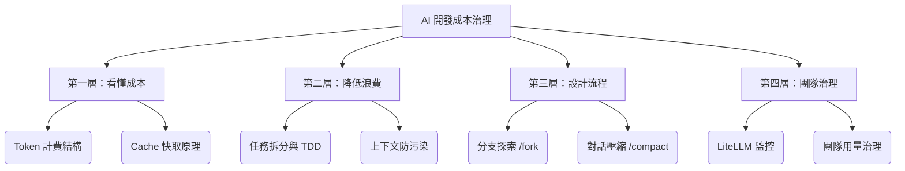

# AI 開發成本優化與 Agent 工作流實戰 教學課程

這是一門為軟體工程師、技術主管與開發團隊設計的 **AI 寫程式成本優化與高效協作實戰課程**。未來開發者的差距，不僅僅在於「誰比較會寫 Prompt」，更在於「誰能用最少的 Token 成本，產出最高品質的程式碼」。

本課程仿照多奇教育訓練的四層治理結構，為您深入剖析 Token 成本成因、快取省錢祕法、高效工作流設計，以及團隊監控與治理實踐。

---

## 課程大綱



---

## 第一單元：AI 寫程式進入用量計費時代

隨著前沿 AI 模型（如 Claude 3.5 Sonnet, GPT-4o 等）在開發工具（如 Cursor, Claude Code, Antigravity）中扮演越來越重的主動代理人（Agent）角色，我們迎來了程式開發的高效時代，卻也面臨了前所未有的「Token 帳單焦慮」。

### 1. 開發者面臨的新現實
* **從「買訂閱」到「控用量」的轉變**：過去我們習慣每個月支付固定訂閱費（如 GitHub Copilot 的 $19/月）無限使用。然而隨著開發工具內建「前沿模型」倍率的調整，高強度使用或跑 Agent 任務時，預設額度經常不到半個月就燒光。許多工具已逐步轉向「用量計費（Pay-as-you-go）」或在用盡超額後收取高額費用。
* **零數據保留（Zero Data Retention, ZDR）的合規挑戰**：在金融、政府或合資企業等高度受管制產業中，不僅需要控管開發成本，還必須遵循嚴格的資安政策（如禁止數據流向境外、不可作為模型訓練資料）。如何在使用 API 時達成安全且高性價比的成本配置，是技術決策者的核心功課。

### 2. 為什麼 AI 寫程式比聊天更燒 Token？
在一般的對話聊天（如網頁版 ChatGPT）中，每次發言的上下文是線性的，且多為文字。
而在 AI 寫程式（Coding Agent）中，每次與 Agent 交互時，工具會自動背負大量的**隱性成本**：
1. **Repository Context (專案上下文)**：為了讓 Agent 了解程式碼，工具會利用向量搜尋（RAG）或直接把多個相關程式碼檔案（如 `game.js`, `player.js`）的全文拼接到每一次的 Input 中。
2. **工具輸出 (Tool Outputs)**：當 Agent 執行 `grep_search`、`run_command`（如跑測試）或讀取大檔案時，工具返回的冗長終端輸出、測試錯誤堆疊（Stack Trace）都會原封不動地塞進下一次的對話上下文。
3. **重試與修復成本**：當 Agent 嘗試修復 Bug 失敗而陷入「猜測-報錯-再猜測」的死循環時，對話上下文會像滾雪球一樣急劇膨脹。

---

## 第二單元：Token 成本結構與快取省錢原理

在用量計費時代，理解 Token 的消耗結構是優化開支的基礎。特別是 **Prompt Caching (提示詞快取)** 技術，它是讓對話費用降低 50%~90% 的絕對主力。

### 1. Token 消耗結構解析
* **Input Tokens (輸入)**：發送給模型的內容，包括歷史對話、提示詞、自動載入的程式碼檔案、工具執行結果。
* **Output Tokens (輸出)**：模型生成的回覆內容。**Output Token 的單價通常是 Input Token 的 3 到 4 倍**。
* **Cached Tokens (快取輸入)**：
  * **Anthropic (Claude)**：提供 `cache_control` 功能。寫入快取（Cache Write）會稍微加收費用，但讀取快取（Cache Read）的單價**僅為普通 Input Token 的 10%**。
  * **OpenAI (GPT-4o)**：自動對重複的 Prompt Prefix 進行快取，快取命中的 Token **直接享有 50% 折扣**。

### 2. Prompt Caching 的運作原理與規則
當我們向模型發送請求時，如果請求的**前綴（Prefix）**與之前某次請求完全一致，模型就可以複用之前已經處理過的快取，而不需重新計算。

```text
一次命中快取的對話流程：
[對話 1] (無快取) -> System Prompt + 檔案內容 (10,000 詞) -> 正常計費 (100% 價格)
[對話 2] (命中快取) -> System Prompt + 檔案內容 (10,000 詞) + 新問題 -> 命中快取的 10,000 詞僅收 10% 價格！
```

> [!IMPORTANT]
> **破壞快取效益的常見錯誤做法**：
> 在對話的中間插入「變動的內容」。例如：在 System Prompt 中加入動態時間、在對話中間臨時貼入一個大日誌、或是每次對話都修改最前面的全域設定。這樣會導致後半段的所有快取全部失效，被迫以 100% 價格重新計費！

### 3. 設定檔（AGENTS.md, CLAUDE.md）與快取成本
當使用 Agent 開發工具時，全域引導文件（如 `.agents/AGENTS.md`、`.claude/skills/.../SKILL.md`）會被載入為 System Prompt 的一部分。
* **為什麼它們影響長期成本？**
  * 這些設定檔通常位於 Prompt 的最前面（Prefix）。如果它們的內容保持**穩定不變**，那麼在同一個對話 Session 中，後續的每一次交互都能 100% 命中快取。
  * 如果您在開發過程中，頻繁手動修改 `AGENTS.md` 或 `CLAUDE.md`，這會導致**每一次對話的快取都被徹底擊穿**，造成 Token 開銷翻倍。
* **利用 Agent Skills 節省 Token**：
  * 將功能性指示（如「如何進行單元測試」、「中文 commit 規範」）以 **Skills**（獨立的子 Markdown 檔案，如 `SKILL.md`）來模組化，只在特定任務需要時透過 Link `@skills/xxx/SKILL.md`「懶加載」引入。這樣可以維持主 System Prompt 的簡潔，避免不必要的 Token 浪費。

---

## 第三單元：降低 Token 浪費的個人實戰技巧

在個人日常開發中，許多 Token 浪費並非模型價格問題，而是**任務交代與操作方式不當**導致的。透過以下四個關鍵技巧，您可以用極低的 Token 成本，取得相同的開發成果。

### 1. 任務拆小原則 (Task Decomposing)
* **痛點**：將一個過於龐大且模糊的需求（例如：「幫我重構戰鬥系統，並新增 5 種新技能與被動天賦」）直接丟給 Agent。
* **後果**：Agent 需要同時讀取、修改十幾個檔案，且極易在代碼整合時發生錯誤。每一次出錯、重試，都會將之前讀取的龐大上下文（數萬 Token）重複發送，造成嚴重的 Token 浪費。
* **解法**：**先拆分，再執行**。
  * **第一步**：請 Agent 先進行 `brainstorming`，只產出「設計規格書」與「實現計劃」（不修改代碼）。
  * **第二步**：將計劃拆分成數個 2~5 分鐘可以完成的小任務（如：建立資料結構 ➡️ 撰寫單元測試 ➡️ 實作邏輯 ➡️ 渲染特效）。
  * **第三步**：逐個任務推進，每完成一步就進行 Git Commit。

### 2. 不要一開始就讓 AI 掃描全專案
* **痛點**：隨意呼叫 `grep_search` 搜尋全專案，或直接使用模糊提問讓 Agent 自動掃描所有目錄。
* **後果**：當專案規模變大，一次全專案掃描會載入數十萬位元組的程式碼與 metadata，直接塞滿對話上限並產生高額的 Input Token 費用。
* **解法**：
  * **精確引路**：直接在提問中 @ 具體的檔案。例如：「請看 [playerCore.js](file:///d:/github/chiisen/survivor.js/js/playerCore.js#L15-L30) 中的 `pickupRange` 更新邏輯...」。
  * **過濾條件**：在使用搜尋工具時，善用包含條件（`Includes`）過濾掉無關目錄（如 `node_modules`、`.git`、`.temp`）。

### 3. 不要盲目貼入大日誌 (Log Filtering)
* **痛點**：測試失敗或程式崩潰時，直接把幾百行的 console 輸出或整個 log 檔案全部貼進對話。
* **後果**：日誌中 90% 是重複的堆疊訊息或無害的 warning，這會稀釋關鍵錯誤，並消耗大量 Token。
* **解法**：
  * **提取精華**：只貼出「錯誤型別 (Error Type)」、「錯誤訊息 (Message)」與「出錯的檔案與行號 (File & Line Number)」。
  * **硬斷言/軟檢查**：在寫程式時實踐 Fail-Fast，讓程式碼在出錯時直接印出高解析度、乾淨的單行 Crash 報告。

### 4. 模型分級調配策略
不同的開發任務需要不同等級的推理能力。混用模型是省錢的王道：
* **機械性任務**（如：重複性的 Unit Test 编写、補寫註解、簡單的 Getter/Setter 暴露）：使用**快速、便宜的小模型**（如 GPT-4o-mini 或 Claude 3 Haiku）。
* **邏輯整合與 Bug 排查**（如：處理多個檔案間的狀態同步、複雜的碰撞算法）：使用**標準的主力模型**（如 GPT-4o 或 Claude 3.5 Sonnet）。
* **架構設計與規格澄清**（如：實作全新的掉落道具系統、規劃系統解耦）：使用**最強的推理模型**（如 GPT-4o、Claude 3.5 Sonnet）。

---


